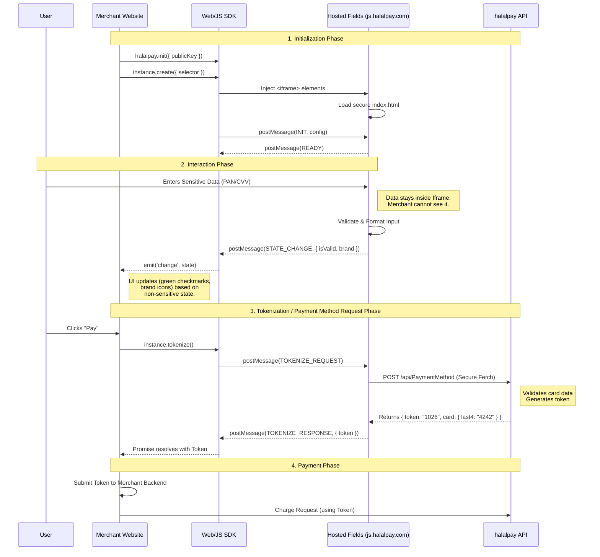

# Web SDK and Hosted Fields

The goal of the halalpay Web SDK and Hosted Fields project is to provide a secure, developer-friendly JavaScript library that allows merchants to collect credit card information on their websites without handling raw payment data

# Architecture


# Installation

To install all dependencies, you can use npm or yarn:

```bash
npm install
```

## Running the Projects
This is nx monorepo, so you can run the projects through nx vs code extension or directly through npm scripts.

step 1: start hosted fields server
```bash
# To all projects concurrently, you can use the following command:
npm run hosted-fields:dev

npx nx run payment-fields:serve
```

step 2: start the API server
```bash
npx nx run backend:serve 
```

step 3: start demo app 

Note: You can open multiple instances of the demo app to test multiple iframes and cross-window communication.
```bash
npx nx run simple-demo:serve
```


## Seeding the Database
Before running the API server, you may want to seed the database with test data. You can do this by running the following command:

```bash

npx nx run backend:seed

```
# Thesis-Final
